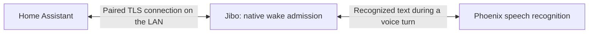

# Phoenix for Home Assistant

Connect Jibo directly to Home Assistant on your local network. Home Assistant Assist resolves your exposed devices, rooms, questions, and owner-selected routines. The built-in conversation agent is the default; an LLM is optional.

**Direct candidate: 0.3.0b3**, with **BE 13.2.2** and **Services 13.0.8**. The firmware layout correction, physical pairing and direct home-command session still need acceptance. Release review remains pending. The installation instructions below describe the candidate and do not establish that its packages are published. The published [0.2.0b2](https://github.com/Paskooter/phoenix-home-assistant/releases/tag/v0.2.0b2) uses the legacy Phoenix cloud connector; its evidence does not validate the new direct connection. See [release validation](docs/validation.md).

## How the direct connection works

Home Assistant opens a certificate-pinned TLS WebSocket to one physically paired Jibo on TCP **9443**. Each robot has its own HA entry and locally generated identity. Enter its local host in HA; any discovery result is only an address suggestion. An eight-digit comparison on Jibo and in HA establishes the pairing.



Jibo admits each home command through its native wake lifecycle before sending it directly to HA. Device state, returned home results, pairing credentials, and the local connection stay on that path. Home Assistant's local announcements and connection health are intended to continue during a Phoenix restart; this still needs candidate validation.

Voice recognition continues to use Phoenix, which sees the utterance and supplies the trusted recognized text during a native voice turn. Operator-provided firmware remains trusted too. Voice still needs Phoenix; local pairing does not provide offline recognition or full transcript privacy. See [trust and permissions](docs/security.md).

## Install and pair

The candidate requires Home Assistant **2026.8.1 or newer**, compatible BE **13.2.2**, and Services **13.0.8** in a Home Assistant mode (`home_assistant` or `home_assistant_ssh`). OS **13.0.7** remains the baseline. BE 13.2.1 passed packaging and normal startup, but its physical pairing countdown was clipped by the Cancel button. Comparison and the direct session were not completed. The beta3 integration passed 93 software cases on each actual HA version; the BE 13.2.2 layout correction, packaging and hardware checks remain pending. See [release validation](docs/validation.md) for the artifact-specific evidence.

1. Install the reviewed compatible robot software and integration package when released. In HACS, add `https://github.com/Paskooter/phoenix-home-assistant` as a custom **Integration** repository, enable prereleases, and choose the compatible direct version. Restart HA.
2. Put HA and Jibo on a network where HA can reach Jibo's TCP 9443. Local mDNS uses UDP 5353; the candidate flow supports manual host entry.
3. On Jibo, open **Settings → Home Assistant → Start pairing** and follow the on-screen instructions. The pairing window lasts **120 seconds**.
4. In **Settings → Devices & services → Add integration → Phoenix**, enter Jibo's local host and port.
5. Compare all **eight digits** shown by Jibo and HA. If they match, approve on Jibo and confirm the match in HA. Cancel if they differ or you did not start the pairing.
6. Assign the paired Jibo device to an HA **Area**, then expose the devices you want through **Settings → Voice assistants → Expose**.

Pairing needs no Phoenix console code, jibo.io password, or HA access token. One robot accepts one HA pairing. Pairing a replacement revokes its old connection. Do not expose TCP 9443 or mDNS to the Internet.

[Installation, migration, and removal](docs/installation.md) explains manual installation, certificate changes, and upgrading an existing cloud entry.

## Commands, rooms, and questions

Use your own Assist names and aliases. Each voice command, including a follow-up, starts with a new “Hey Jibo” turn.

| Purpose | Example |
| --- | --- |
| Named light | Turn on the bedroom light. |
| Room lights | Turn on the lights here. |
| Light off | Turn off the kitchen lights. |
| Brightness | Set the bedroom light brightness to fifty percent. |
| Supported color | Set the bedroom light to blue. |
| Named switch | Turn on the garden switch. |
| Scene or script | Activate the dinner scene. / Run the relax script. |
| Explicit invocation | Ask Home Assistant to turn on Cooking Lamp. |
| Read-only question | Are the lights here on? / What is the kitchen temperature? |

Home Assistant resolves names, aliases, areas, supported sentences, and features. Assign the Jibo device to an HA area for “here” or “turn on the lights.” Without an assigned area, a generic room command asks for room setup instead of expanding to the whole home. An explicit target name remains usable.

Local state questions read only Assist-exposed states and do not invoke an executing conversation agent. Unknown, ambiguous, unavailable, or unexposed targets return an error. Temperature and humidity questions need a corresponding sensor or climate measurement.

For up to **30 seconds** after a successful home turn, the same robot can use fresh resolved targets in phrases such as “turn them off,” “set it to blue,” or “make them dimmer.” Relative brightness changes by about ten percentage points and requires usable brightness on every target. HA rechecks exposure and device capabilities. Disconnect, restart, errors, or uncertain results clear the context.

Ordinary Jibo commands, cancellation, and active-skill replies keep their routing. A cloud routing hint cannot create a native wake, extend follow-up expiry, or authorize a home action.

## Routine phrases and conversation agents

In **Phoenix → Configure**, add an exact routine phrase and select an Assist-exposed scene or script. For example, map “reading time” to an invented reading scene. Matching normalizes case, whitespace, and final punctuation, then requires an exact match. Up to 16 bounded phrases are supported. HA checks exposure again before activation and reports a scene or script as **started**, without claiming every resulting device state.

The default conversation agent is **Home Assistant (built-in)**. Configure may select another installed agent, including Jev. Its provider settings and permissions remain local HA settings, and its own data handling applies. A missing selected agent produces an unavailable error without silently switching agents. Slow work can exceed the voice deadline.

## Robot sensors

Each directly paired robot provides these 15 entities. Values stay on the paired LAN connection and are read only.

| Entity | Reading |
| --- | --- |
| Battery | Percent |
| Battery temperature | Temperature |
| Camera | Idle, active preview, or disabled by the hatch |
| Charging state | Charging, not charging, or not plugged in |
| CPU temperature | Temperature |
| Fan speed | Percent of maximum |
| Hatch state | Open or closed |
| Head touch | On or off, with immediate touch updates |
| Main board temperature | Temperature |
| Microphone RMS | Sound level in dB; no audio samples |
| Online | Authenticated direct connection health |
| Plugged in | Plugged in or unplugged |
| Sleeping | Native asleep state |
| Speaker volume | Percent; does not change volume |
| System voltage | Volts |

HA converts native Celsius temperatures to your preferred display unit. Missing or stale readings become unavailable within 30 seconds; a disconnected socket clears all measurements. Camera describes native preview/hatch status and provides no image stream. An idle preview does not mean Jibo's perception cameras are powered off.

## Announcements from HA

Announcements are **off by default**. Enable the candidate's local **Allow announcements** option in **Phoenix → Configure** when you want automations to speak through this robot. Direct permission is local; the legacy console permission does not enable it, and there is no second robot toggle. Each new local session starts with permission off until authenticated HA preferences apply the saved option.

Choose optional quiet hours in the same options. They use HA's time zone and may cross midnight. Announcements use Jibo's current volume; there is no per-announcement volume setting.

In **Developer tools → Actions**, choose **Notifications: Send a message** and the paired Jibo's **Announcement** entity. An automation can use:

```yaml
action: notify.send_message
target:
  entity_id: notify.jibo_announcement # Choose your actual paired robot's entity.
data:
  message: "Dinner is ready."
```

Use plain text of at most **300 characters**, without a title. Quiet hours, disabled permission, an offline or busy robot, and expiry reject the request without queuing it. Success requires acknowledgement that native speech completed. A lost response is uncertain and is never retried automatically. A native voice turn or supported local touch interruption can stop the owned announcement; cancellation does not claim any completed device action was undone.

## Diagnostics and uncertain results

**Connection** and robot diagnostics describe the paired HA–Jibo LAN session. They do not establish Phoenix recognition availability or distinguish a powered-off robot from every possible network failure. Diagnostics should omit credentials, pins, addresses, household identifiers, and utterances.

Requests have short deadlines and are remembered durably before execution. Reconnect and restart do not queue or replay actions. If a response is lost, the device might already have changed. Check its state before trying again.

Light and switch on/off commands wait for their resolved HA targets to report the requested state within the command deadline. Scene, script, and custom-agent outcomes retain their own completion semantics. See [troubleshooting](docs/troubleshooting.md).

## Upgrade and remove

Upgrading a protocol-1 cloud entry puts it into **migration required**. It does not reconnect to Phoenix's old cloud socket or silently fall back. Preserve the HA backup, physically pair one robot, and explicitly choose its old device/area mapping. Agent, routine, and quiet-hours options remain; announcements require a fresh local opt-in. Each additional robot needs its own pairing and entry. After successful local pairing, HA attempts to revoke the old cloud installation and removes its old credential. If that cleanup cannot reach Phoenix, follow the manual console cleanup instruction.

Removing the HA entry attempts to revoke the local pairing and removes its local request ledger. If the robot is unreachable, use **Settings → Home Assistant → Forget** on Jibo and confirm before considering access revoked. Disabling an entry stops HA's socket but is not a durable robot revocation. Forgetting or revoking a pairing keeps direct mode selected; it does not restore cloud home commands or announcements. See [installation and removal](docs/installation.md) for the full sequence.

## Development and evidence

[Protocol](docs/protocol.md) documents the candidate wire contract. [Security](docs/security.md) explains its trust boundary. [Validation](docs/validation.md) separates pending direct release checks from historical cloud-connector evidence. Public fixtures use invented devices and identities; private captures and household storage stay out of Git.
